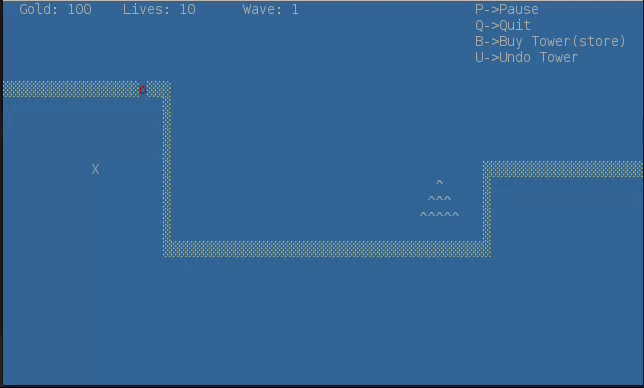
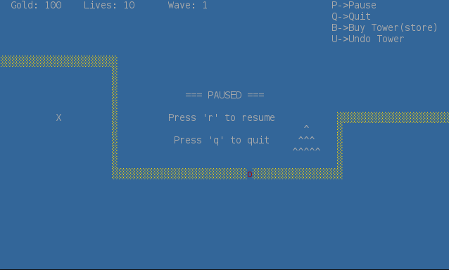
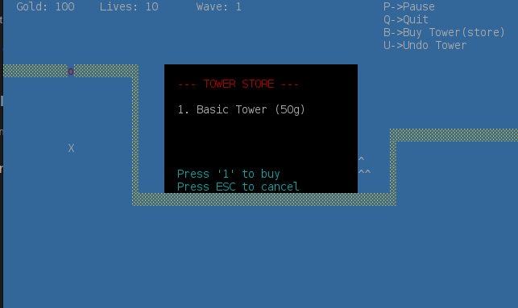
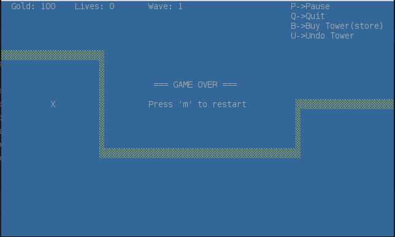

# LDTS_10_04 - Tower Defense Game

## Game Description

The Tower Defense Game is a casual game where the mission is to build and strengthen your defenses to stop an increasingly strong amount of enemies from reaching the end of the path. After either defeating an enemy or clearing a wave the player is rewarded with gold coins which can be used to enhance even further one's defenses and find the way to success. As time goes by so does the difficulty of the challenge.

This project was developed by Francisco Torres (up202406332@up.pt), João Couto (up202405017@up.pt), Tiago Santos( up202403362@up.pt) for LDTS 2025-26.

For a more detailed version of this description click [here](./docs/README.md).

## Screenshots

The following screenshots ilustrate the general look of our game, as well as the divergent functionalities:
### Game preview

  

  <b><i>Gif 1. Sneak peak into The Tower Defense game</i></b>

 
 

### Menus

  

  <b><i>Fig 1. Pause Menu </i></b>

  

 
 

  

  <b><i>Fig 2. Buy Tower Menu </i></b>  

  

 
 

  

  <b><i>Fig 3. Game Over Menu </i></b>

  

 
 
