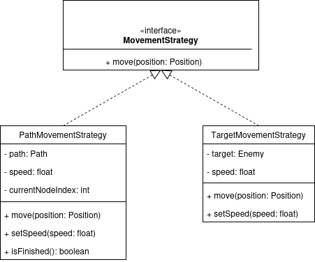
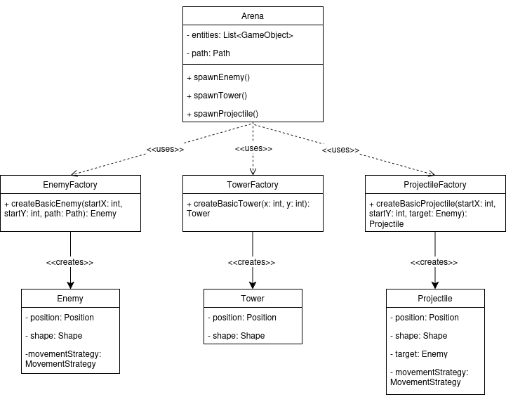

# LDTS_10_04 - Tower Defense Game


# LDTS_10_04 - Tower Defense Game


## Game Description

The Tower Defense Game is a casual game where the mission is to build and strengthen your defenses to stop an increasingly strong amount of enemies from reaching the end of the path. After either defeating an enemy or clearing a wave the player is rewarded with gold coins which can be used to enhance even further one's defenses and find the way to success. As time goes by so does the difficulty of the challenge.

This project was developed by Francisco Torres (up202406332@up.pt), João Couto (up202405017@up.pt), Tiago Santos( up202403362@up.pt) for LDTS 2025-26.


## Implemented Features

- **Path** - The enemies move along a path.
- **Towers** - The towers shoot as soon as they have an enemy in range.
- **Projectiles** - Projectiles follow and hit enemies.
- **HUD/menus** - There should be a menu showing the player’s health, coins, and available towers.

## Planned Features

- **Economy** - The player gets coins after clearing waves and defeating enemies. The coins can be used to upgrade the defenses.
- **Health** - The player has a certain amount of health which is depleted every time an enemy reaches the end of the path.
- **Increasing difficulty waves** - Enemies come with increasingly high health and speed after each wave.
- **Different towers and enemies** - There will be different kinds of towers and enemies to add diversity and depth to the game.
- **Interactive tower placement** - The player will be able to place the towers anywhere on the map as long as it doesn't conflict with the path.

## Design

### THE MOVEMENT LOGIC OF ENEMIES AND PROJECTILES WAS DUPLICATED AND HARD TO EXTEND

- **Problem in Context:** In the first running version of the project both Projectiles and Enemies have their own movement logic defined within the move()/update() methods:

    - **Enemy Movement:** Enemies follow a list of positions from *Path*, moving from one node to the next, where nodes are the intersection points of the horizontal and vertical lines that form the path.

    - **Projectile Movement:** The projectiles move directly towards a target, by calculating a direction vector, normalizing it, and adjusting their position accordingly.

  Even though the algorithms are different, they both share the same conceptual responsibility/idea: "moving a GameObject".
  This leads to several architectural problems:

    - **Violation of the Single Responsibility Principle (SRP):** Classes have several responsibilities (state management, rendering, and movement logic), violating the principle that each module should have only one reason to change.

    - **Violation of the Release Reuse Equivalency Principle (REP):** The duplication of movement logic required copying and pasting code between classes, which means there's reusing of code through copying and pasting between classes rather than properly developed components.

    - **Violation of the Open/Closed Principle (OCP):** Implementing new enemies or new projectiles with different movement behaviours meant modifying existing code, instead of allowing extension through new code.

    - **Violation of the Dependency Inversion Principle (DIP):** Reduced testability results from the fact that there are direct dependencies between high-level modules (tests) and concrete implementations (Enemy/Projectile), rather than depending on abstractions.

- **The Pattern:** We applied the Strategy Pattern to encapsulate each movement algorithm in its own class, making them interchangeable and easy to manage. This pattern is adequate because:
    - movement is a variable behaviour, different for each type of object;
    - we want an object to have a movement strategy instead of being responsible for it;
    - we want to make it easier to create new types of movement without the need to modify existing classes;
      This way we created a shared interface (MovementStrategy) and two concrete strategies (will be more once we add more enemies and projectiles):
    - PathMovementStrategy - sequential movement along a Path (for the enemy);
    - TargetMovementStrategy - moving towards the Enemy (for the Projectile);
      Each object uses the right strategy, isolating the behaviours and making the code expandable.

- **Implementation:** The implementation is based on three main elements:

  <p align="center" justify="center">
  
</p>

<p align="center">
  <b><i>Fig. 1 — Strategy Pattern UML Diagram</i></b>
</p>

- *Interface MovementStrategy:*

  ```java
  public interface MovementStrategy {
      void move(Position position);
  }
  ```

- *Concrete Strategies:*

  PathMovementStrategy(Enemy):

    ```java 
    public class PathMovementStrategy implements MovementStrategy {
      private Path path;
      private float speed;
      private int currentNodeIndex = 0;

      public PathMovementStrategy(Path path, float speed) {
      this.path = path;
      this.speed = speed;
      }

      public void setSpeed(float speed) {
          this.speed = speed;
      }

      @Override
      public void move(Position position) {
          if (isFinished()) return;
          Position targetNode = path.getNodes().get(currentNodeIndex);

          if (position.getX() < targetNode.getX()) position.setX(position.getX() + speed);
          if (position.getX() > targetNode.getX()) position.setX(position.getX() - speed);
          if (position.getY() < targetNode.getY()) position.setY(position.getY() + speed);
          if (position.getY() > targetNode.getY()) position.setY(position.getY() - speed);

          if (Math.abs(position.getX() - targetNode.getX()) < 1.0 && Math.abs(position.getY() - targetNode.getY()) < 1.0) {
              currentNodeIndex++;
          }
      }

      public boolean isFinished() {
          return currentNodeIndex >= path.getNodes().size();
      }
    }
    ```

  TargetMovementStrategy(Projectile):

    ```java
    public class TargetMovementStrategy implements MovementStrategy {
      private Enemy target;
      private float speed;

      public TargetMovementStrategy(Enemy target, float speed) {
          this.target = target;
          this.speed = speed;
      }

      public void setSpeed(float speed) {
          this.speed = speed;
      }

      @Override
      public void move(Position position) {
          if (target == null) return;
          Position tPos = target.getPosition();

      float dx = tPos.getX() - position.getX();
      float dy = tPos.getY() - position.getY();
      float dist = (float) Math.sqrt(dx * dx + dy * dy);

      if (dist <= speed) {
          position.setX(tPos.getX());
          position.setY(tPos.getY());
      } else {
          position.setX(position.getX() + (dx / dist) * speed);
          position.setY(position.getY() + (dy / dist) * speed);
          }
      }
    }
    ```

- **Consequences:** This allowed us to further enhance extensibility while reducing the amount of conditionals and duplication through specialized behaviour classes. We now define movement logic via polymorphism, allowing enemies to maintain state while strategies handle motion. The same strategies can be reused across several objects and can be tested individually. The trade-off is having more classes to manage, but with significantly better organization.

### CREATING ENEMIES AND TOWERS WITHOUT DUPLICATED CONSTRUCTION LOGIC

- **Problem in Context:** In the first running version of the project Towers, Enemies and Projectiles are directly instantiated inside the Arena Class. This means that the arena was directly responsible for game logic as well as knowing how to construct every type of enemy and tower. This leads to a strong dependency between the Arena and the classes of the game and results in:
    - **Violation of the Single Responsibility Principle (SRP):** The Arena class had several responsibilities such as managing game logic, managing game state, creating Towers, creating Enemies, creating Projectiles, and setting their stats. This means that to change Tower, Enemy and projectile stats or visuals modifying the Arena is required and also that the Arena grows unnecessarily.

    - **Violation of the Open/Closed Principle (OCP):** Implementing new kinds of Towers, Enemies or projectiles meant modifying existing code, instead of allowing extension through new code.

    - **Violation of the Dependency Inversion Principle (DIP):** Arena is a high-level module, but it directly depends on low-level concrete classes such as Tower, Enemy, Projectiles, etc. This forces the Arena to change whenever a new Tower, Enemy or Projectile is added. With the introduction of factory classes the Arena depends only on abstractions rather than concrete implementations, reducing coupling and increasing extensibility.

    - **Violation of the Common Closure Principle (CCP):** Both Tower and Enemy construction logics are mixed inside Arena, which means changes to their attributes also cause changes in the Arena. But enemies and towers belong to different conceptual groups, and they should change independently.


- **The Pattern:** We used the Factory Pattern to encapsulate and centralize the creation of game entities into separate factory classes. This pattern is adequate because:
    - the creation of objects is a variable behaviour ( changes depending on whether it is a Tower, an Enemy or a Projectile);
    - the Arena shouldn’t be responsible for instantiating concrete game entities;
    - in the future new kinds of Towers, Enemies and Projectiles will be added and we'd like to do so without modifying the Arena (keeping the system open for extension but closed to modification (OCP));
    - avoids duplication, since the construction details are now kept in an isolated place instead of repeated inside the Arena;

- **Implementation:** To achieve this, we created three factory abstractions:

  <p align="center" justify="center">
  
</p>

<p align="center">
  <b><i>Fig. 2 — Factory Pattern UML Diagram</i></b>
</p>

- *TowerFactory:*

  ```java
  public class TowerFactory {


  public static Tower createBasicTower(int x, int y) {
      Shape pyramid = new Shape();


      pyramid.add(0, -2, '^');
      pyramid.add(-1, -1, '^');
      pyramid.add(0, -1, '^');
      pyramid.add(1, -1, '^');

      pyramid.add(-2, 0, '^');
      pyramid.add(-1, 0, '^');
      pyramid.add(0, 0, '^');
      pyramid.add(1, 0, '^');
      pyramid.add(2, 0, '^');

      return new Tower(x, y, pyramid);
      }
  }
  ```

- *EnemyFactory:*

  ```java
  public class EnemyFactory {

  public static Enemy createBasicEnemy(int startX, int startY, Path path) {
      Shape enemyShape = new Shape();
      enemyShape.add(0, 0, 'o');
      return new Enemy(startX, startY, enemyShape, path);
      }

  }
  ```

- *ProjectileFactory:*

  ```java
  public class ProjectileFactory {

  public static Projectile createBasicProjectile(int startX, int startY, Enemy target) {
      Shape projectileShape = new Shape();
      projectileShape.add(0, 0, '*');
      return new Projectile(startX, startY, projectileShape, target);
      }

  }
  ```
The arena now requests entities from the factories not needing to instantiate them itself. This makes the code cleaner, with reduced coupling and makes the creation logic significantly easier to extend as the game develops.

- **Consequences:** The Factory Pattern improves the organization as well as the extensibility of our code centralizing the creation of Towers, Enemies and Projectiles. This removes duplication and conditionals inside the Arena, which made it easier to introduce new entity types without modifying existing logic. The Arena now depends on abstract factories rather than concrete classes, which leads to reduced coupling and follows the Dependency Inversion Principle. On top of that, factories can also be tested separately. The trade-off is a few extra classes, but overall there's a better, cleaner and easier to evolve structure.

### SEPARATING GAME MECHANICS FROM THE HUD USING THE OBSERVER PATTERN

- **Problem in Context:** After implementing the previous patterns, we wanted to introduce the first version of a HUD. However, the way that the project was organize made it difficult to do so without adding a lot of new code to the Arena where we had all the game mechanics. This would mean that after adding the HUD the Arena would have to handle not only game mechanics but also updating visual information shown to the player on the screen, such as: health, coins and wave number. This introduced several design problems:

    - **Violation of the Single Responsibility Principle (SRP):** The Arena class would have several responsibilites game mechanics and, on top of that, HUD/visual information management.

    - **Violation of the Open/Closed Principle (OCP):** Adding HUD elements or modifying them meant having to change the game logic files.

    - **Violation of the Interface Segregation Principle (ISP):** If we put the HUD logic in the Arena, there would be in the Arena exposed methods only the HUD handles. This would force other game parts to depend on unneeded features, leading to an unnecessary increase in the Arena's complexity.

    - **Violation of the Common Reuse Principle (CRP):** Having the HUD and Arena implemented together would mean changes in the HUD require changes in the Arena. This shouldn't happen since HUD and game mechanics are separated concepts and do not rely on each other.

- **The Pattern:** We decided to use the Observer Pattern to separate game mechanics from the HUD and any future component that might need to react to game events. This is a good aproach because:

    - game changes state often (gold, lives, etc) and there are different parts of the game (such as the HUD) that react to those changes independently;
    - the Arena must focus on managing game mechanics and not visual updates or secondary systems;
    - if in the future we want to add new observers (like statistics panels, or sound alerts for example) they can be added without touching in the Arena, keeping the code open for extension but closed for modification (OCP);
    - it is a way of avoiding unnecessary dependencies, because this way observers rely solely on the Subject interface and not the Arena's internal structure;

- **Implementation:** The implementation is based on three main elements:

  <p align="center" justify="center">
  
</p>

<p align="center">
  <b><i>Fig. 3 — Observer Pattern UML Diagram</i></b>
</p>

- *Observer Interface:*

  ```java
  public interface Observer {
  void update();
  }
  ```

- *Subject Interface:*


    ```java 
      public interface Subject {
    void attach(Observer o);
    void detach(Observer o);
    void notifyObservers();
    }
    ```

- *Arena as the Subject (code snippet):*

  ```java
    public class Arena implements Subject {

  private final List<Observer> observers = new ArrayList<>();
  private int gold = 100;
  private int lives = 10;
  private int wave = 1;

  @Override
  public void attach(Observer o) {
      observers.add(o);
  }

  @Override
  public void detach(Observer o) {
      observers.remove(o);
  }

  @Override
  public void notifyObservers() {
      for (Observer o : observers) {
          o.update();
      }
  }

  public void startNextWave() {
      wave++;
      notifyObservers();
  }

  public void update() {
      // whenever enemies die or reach the end (gold or health changes):
      notifyObservers();
    }
  }
  ```

- **Consequences:** There are several positive consequences after the addition of the Observer pattern to our project:

    - decoupling between HUD and game logic they don't rely on each other;
    - increased extensibility since new observers such as statistics or sound triggers can be added without any change to the game logic;
    - the code respects SRP since mechanics and visual updates are completely separated;

  The only trade-off is the introduction of more classes and interfaces, but the structural improvement totally justifies it.

### TESTING

- Screenshot of coverage report.
- Link to mutation testing report.

### SELF-EVALUATION

Throughout the whole process of developing this game, the whole group split task/workload equally. Everyone took an important role and was involved the whole time. Therefore we decided that everyone contributed the same:

- Francisco Torres: 33.3%
- João Couto: 33.3%
- Tiago Santos: 33.3%